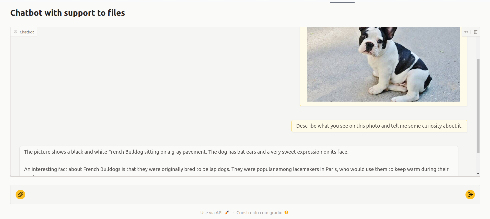

# Chatbot with Support to Files 🤖📂  

**Chatbot with Support to Files** is an innovative application designed to enhance user interaction through intelligent file interpretation. This chatbot leverages advanced AI capabilities to process and understand various types of files, including images, text documents, spreadsheets, and more, based on user requests.

In a world where information is often scattered across multiple formats, this chatbot provides a seamless solution by allowing users to upload files and receive insightful interpretations. Whether it's extracting data from a spreadsheet, summarizing a text document, or analyzing an image, the chatbot is equipped to handle diverse file types and respond accurately to user inquiries.

---

## Application Layout  

 

## Features  

The Chatbot simulates a range of functionalities designed to enhance user experience and provide accurate file interpretation. These features allow the AI to analyze different file types effectively. This App demonstrate how AI can facilitate effective communication and enhance information accessibility through intelligent file interpretation.

---

## Getting Started  

Follow the steps below to set up and run the Chatbot locally.

### Installation  

1. **Clone the Repository**:  
   ```bash
   git clone git@github.com:kelsonbatista/chatbot-with-ai-gemini.git

2. **Navigate to the Project Directory**:  
    ```bash
    cd chatbot-with-ai-gemini

3. **Start the Application**:  
   ```bash
   python chatbot4-with-files.py

4. **Open Your Browser**: 
   ```bash 
   Navigate to http://localhost:7860 to access the app.

## Build With
- **Python**: Core programming language used for backend and AI functionalities.
- **Gradio**: Interface library that simplifies the creation of user-friendly web applications.
- **Gemini Generative AI**: Advanced technology for engagement analysis and decision-making.
- **Hugging Face Spaces**: Hosting platform for seamless deployment.

## Live Demo
🔗 **Live Demo**: [Fitness App](https://kelsonbatista-chatbot-with-ai-gemini.hf.space)  
